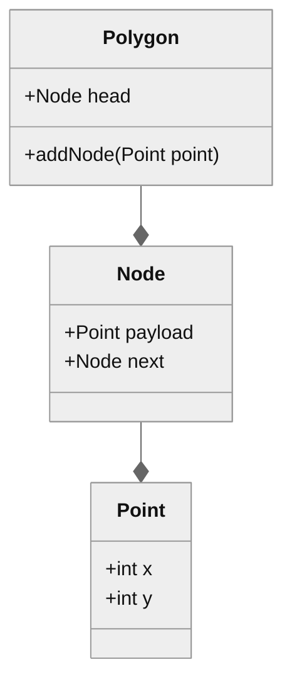
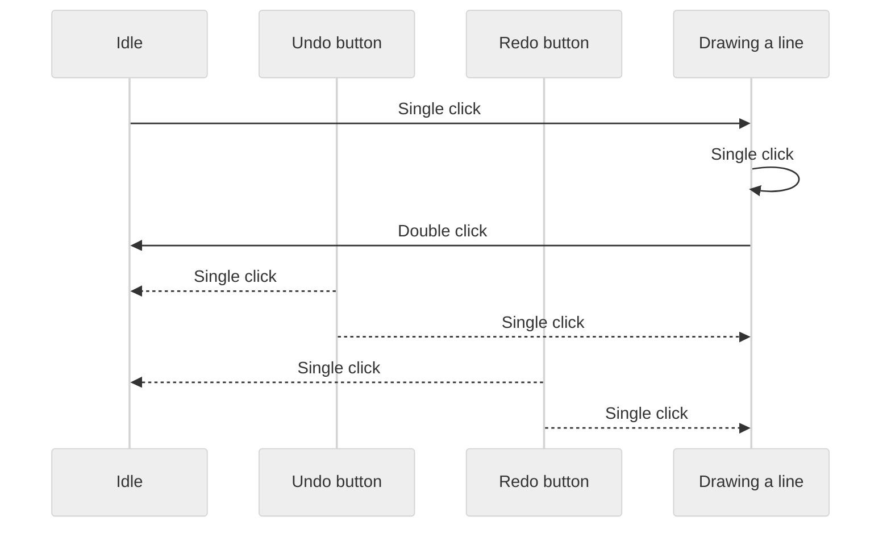

# Drawing Polygons

This application draws polygons using HTML 5 canvas and TypeScript.

## Building

This application is containerized with Docker. The `Makefile` provides a quick interface for starting and stopping the application.

- `make` --- Build the Docker image, compile the code, and start the application.
- `make shell` --- Open the container's shell.
- `make compile` --- Compile TypeScript.
- `make watch` --- Compile TypeScript in watch mode.
- `make stop` --- Stop the running container.
- `make clean` --- Stop the running container, then remove it and the built image.

## Usage

Visit the running application at `localhost:8080`. Left clicks start and end lines, while right clicks end shapes. The undo and redo buttons do what you would expect.

## Modelling

### Domain objects

### Sequence Diagram

